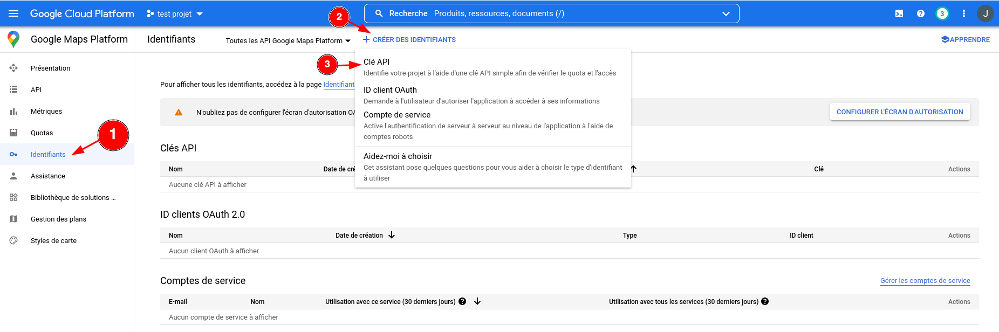
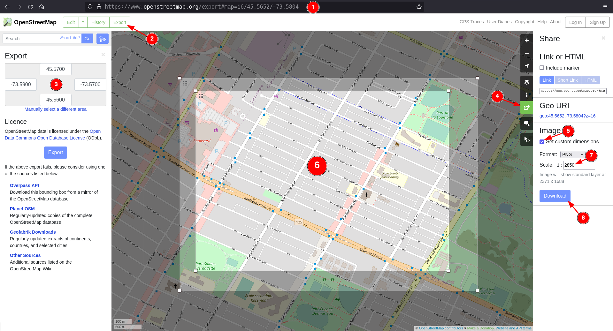

# QS : Afficheur de membres sur une carte


# Description

Avec une liste d'adresses, il est possible d'automatiquement trouver les coordonnées géographiques (latitude, longitude) de ces adresses, puis de les placer sur une carte.

Ceci est fait notamment à l'aide d'un compte Google Developpers (voir [Compte Google Developpers](#compte-google-developpers) pour la marche à suivre pour en obtenir un), des scripts de ce répertoire ainsi que d'un peu d'huile de bras pour générer les cartes.

Notez que je souhaitais m'affranchir de Google pour faire ce projet, mais les alternatives que j'ai essayé ne trouvaient pas les adresses correctement. Si vous connaissez quelque chose qui permettrait de trouver les coordonnées d'adresses automatiquement, merci de m'en faire part à [blier.jacob@hotmail.com](mailtomailto::blier.jacob@hotmail.com)!


# Comment installer et préparer l'exécution du programme

## Prérequis :
  - [Python 3](https://www.python.org/downloads/)
  - Fichier contenant une liste d'adresses ([exemple provenant du répertoire](https://github.com/jacobblier/QS_Membres_sur_carte/blob/main/donnees/adresses.csv)). Ce fichier peut généralement être obtenu en demandant au National.
  - Télécharger et dézipper le contenu de ce répertoire en cliquant sur le bouton vert `Code`, puis sur `Download ZIP` comme sur l'image ici-bas. Ne pas oublier de cliquer-droit sur le fichier téléchargé et de choisir l'option pour extraire le contenu du dossier.


## Compte Google Developpers

Note : Si les coordonnées géographiques des adresses sont déjà connues, il n'est pas nécessaire d'avoir un compte Google Developpers.

### Premiers pas

Aller sur [Google Developpers Google Maps Platform](https://console.cloud.google.com/google/maps-apis/overview) et se connecter avec un compte Google.

La page demandera alors quelques informations de base pour finaliser la création du compte.

### Créer un projet

Dans la page finalement ouverte, en haut à droite, cliquer sur `CRÉER UN PROJET`. Voir l'image qui suit.


Donner un nom de projet (ex : `Carte membre QS Laurier-Dorion`). Le nom n'est pas très important, tant qu'il est posible de s'en rappeler.
Choisir `Aucune organisation` dans le menu déroulant nommé `Zone`.
Cliquer sur `CRÉER`.

### Choisir les API à utiliser

Une fois le projet créé, cliquer sur les API suivantes et les activer :
  - Geocoding API
  - Maps Static API
  - Time Zone API

En cliquant sur `API` dans le menu de gauche, les API activées devraient être comme sur l'image suivante suivante :


### Générer une clé API

Il faut maintenant générer et obtenir une clé API qui devra être intégrée au [fichier de configuration](/donnees/config) du code.
Cliquer sur `Identifiants` dans le menu de gauche, puis sur `+ CRÉER DES IDENTIFIANTS` en haut et finalement sur `Clé API`, comme sur l'image qui suit :

La clé API générée peut alors être copiée à la fin de la ligne `cle_api_Google=` du [fichier de configuration](/donnees/config).


### Mettre une option de paiement

Obtenir les coordonnées géograpiques liées à des adresses ne devrait rien couter à moins de faire plusieurs milliers de requêtes, mais il est obligatoire d'associer une carte de crédit au compte pour que les requêtes fonctionnent.

En haut à gauche, cliquer sur le menu hamburger (les trois lignes horizontales une par-dessus l'autre), puis sur `Facturation`, comme sur l'image ici-bas :


Sur la page qui ouvre, cliquer sur `GÉRER LES COMPTES DE FACTURATION`.

Sur la page qui ouvre, cliquer sur `AJOUTER UN COMPTE DE FACTURATION`.

Remplir les informations demandées.

**Rappel** : Aucun montant ne devrait être chargé sur la carte de crédit entrée (du moins, aucun montant ne m'a été facturé à moi). Si des craintes subsistent, il est facilement possible (si ce n'est pas fait automatiquement) d'obtenir des quelques centaines de dollars de la part de Google pour faire des requête, ce qui devrait couvrir les besoin de chaque circonscription, en théorie.
Pour voir si des crédits gratuits sont disponibles, cliquer sur le menu hamburger en gaut à gauche, puis sur `Facturation`. La vue d'ensemble affichée devrait contenir une section appelée `Crédit d'essai gratuit` où le montant est affiché.


## Mise en place de Python

Après avoir installé la plus récente version de Python sur l'ordinateur, il faut exécuter une commande pour télécharger certains modules Python.

Pour ce faire, aller dans le dossier où le code se trouve (par exemple, `C:\Users\<nom>\Downloads\QS_Membres_sur_carte\`). Une fois à cet endroit, cliquer dans la "barre d'adresse" en haut de la fenêtre (ou utiliser le raccourci clavier `<ctrl>+<L>`), puis entrer `cmd.exe` avant d'appuyer sur `<Enter>`. Une fenêtre contenant un peu de texte devrait s'afficher. C'est l'invite de commande, comme montré sur l'[image suivante](https://en.wikipedia.org/wiki/Cmd.exe) :


Dans cet invite de commande, entrer

```
python -m pip install -r requirements.txt
```

Des écritures ainsi que des barres de progression apparaitront dans l'invite de commande pendant quelques minutes, le temps de télécharger les modules manquants.

Python devrait maintenant être correctement configuré pour exécuter le code.


# Comment utilier le code?

## Obtenir les coordonnées

La première chose à faire est de configurer les paramètres dans le fichier `config` (`<dossier où se trouve le code>/donnees/config`). Le code ne s'exécutera pas correctement sans cela.

Lorsque la configuration est faite, aller dans le dossier où le code se trouve et ouvrir l'invite de commande comme dans la section de [mise en place de Python](#mise-en-place-de-python). Dans l'invite de commande qui s'ouvre, entrer

```
python src\Membres_sur_carte\coordonnees_a_partir_d_adresses.py
```

Le programme passera alors à travers toutes les adresses présentes dans le fichier entré dans `chemin_du_fichier_csv_d_adresses` et sortira les coordonnées trouvées dans le fichier mis dans `chemin_du_fichier_csv_de_coordonnees` et les adresses problématiques dans `chemin_du_fichier_d_erreurs`.


## Mettre les points sur la carte

### Prérequis

  - Avoir un fichier avec les coordonnées géographiques extraites à partir d'adresses
  - Avoir rempli adéquatement le fichier de configuration (`donnees/config`)
  - Avoir des images de la carte à afficher (voir la section [Images pour la carte](#images-pour-la-carte))

### Images pour la carte

Pour que les coordonnées géographiques soit placées sur une carte et non sur un fond blanc, il faut extraire des images d'une carte.

Ces images doivent être placées à un endroit précis (`<dossier où se trouve le code>\donnees\`) et nommées d'une manière précise pour que le code fonctionne. Le nom des fichiers doit être dans le format suivant : `carte_<longitude minimale>,<longitude maximale>,<latitude minimale>,<latitude maximale>.png` (par exemple, `carte_-73.61,-73.59,45.55,45.56.png`).

Pour obtenir ces fichiers, il existe surement plusieurs manières de faire, mais celle que j'ai utilisé est la suivante. (Je ne dis pas que c'est la meilleure, loin de là puisqu'elle demande beaucoup de travail manuel, mais je n'en ai pas trouvé d'autres.)
  1. Aller sur [OpenStreetMap](https://www.openstreetmap.org/).
  2. Cliquer sur le bouton `Export` en haut à gauche.
  3. Entrer les coordonnées d'un rectangle adéquat contenant la carte qui doit être exportée. Note : Ce qui est visible à l'écran est exactement ce qui sera exporté, c'est-à-dire qu'une fois les points placés sur la carte par le programme, zoomer sur la carte ne donnera pas plus de détails que ce qui est visible maintenant.
  4. Cliquer sur le bouton de partage, à droite de l'écran (un petit carré avec une flèche en sortant).
  5. Cocher la case `Set custom dimensions` dans la barre qui s'est ouverte à droite.
  6. Changer la forme du rectangle qui vient de s'afficher afin qu'il se superpose parfaitement sur le rectangle généré à l'étape 3.
  7. Écrire le chiffre `1` dans le champ à droite de `Scale: 1 :`. Note : Ce chiffre sera automatiquement ajusté pour une autre valeur lorsque le champ ne sera plus en focus. C'est normal.
  8. Cliquer sur `Download` et enregistrer le fichier avec le format de nom présenté plus haut et à l'emplacement demandé (`<dossier où se trouve le code>\donnees\`).
  9. Répéter pour toutes les zones de carte nécessaires.



### Points sur la carte

Pour finalement mettre les points sur la carte, aller dans le dossier où le code se trouve et ouvrir l'invite de commande comme dans la section de [mise en place de Python](#mise-en-place-de-python). Dans l'invite de commande qui s'ouvre, entrer

```
python src\Membres_sur_carte\membres_sur_carte.py
```

Quelques secondes s'écouleront (généralement, plus il y a d'images de carte, plus ce sera long) puis une nouvelle fenêtre s'ouvrira avec la carte et les points placés dessus.

Il est possible de zoomer et de se déplacer sur cette carte à l'aide des boutons en bas à gauche de cette nouvelle fenêtre.

Rappel : Pour changer l'aparence des points et de la carte, les valeurs dans le fichier de configuration (`<dossier où se trouve le code>\donnees\config`) sont modifiables.


# Add a License


# How to Contribute to the Project


# Todo

- Voir si un simple double-clic sur un script Python dans Windows l'exécute.
  - Si c'est le cas, changer le README pour enlever les lignes de code dans [Obtenir les coordonnées](#obtenir-les-coordonnes) et dans [Points sur la carte](#points-sur-la-carte) pour dire de simplement double-cliquer sur les scripts.
- Écrire des tests pour le code
