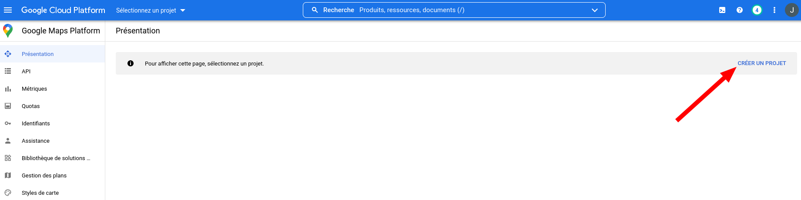

# What was your motivation?

# Why did you build this project?

# What problem does it solve?

# What did you learn?

# What makes your porject stand out?

------
# Project's Title

QS : Afficheur de membres sur une carte

# Project Description

Avec une liste d'adresses, il est possible d'automatiquement trouver les coordonnées géographiques (latitude, longitude) de ces adresses, puis de les placer sur une carte.

Ceci est fait notamment à l'aide d'un compte Google Developpers (voir [METTRE_LE_LIEN] pour la marche à suivre pour en obtenir un), des scripts de ce répertoire ainsi que d'un peu d'huile de bras pour générer les cartes.

Notez que je souhaitais m'affranchir de Google pour faire ce projet, mais les alternatives que j'ai essayé ne trouvaient pas les adresses correctement. Si vous connaissez quelque chose qui permettrait de trouver les coordonnéesd'adresses automatiquement, merci de m'en faire part [METTRE_LE_LIEN_POUR_ME_REJOINDRE]!

# Table of Contents (optional)

# How to Install and Run the Project

## Prérequis :
  - [Python 3](https://www.python.org/downloads/)
  - Fichier contenant une liste d'adresses ([exemple provenant du répertoire](https://github.com/jacobblier/QS_Membres_sur_carte/blob/main/donnees/adresses.csv)). Ce fichier peut généralement être obtenu en demandant au National.
  - Télécharger et dézipper le contenu de ce répertoire en cliquant sur le bouton vert `Code`, puis sur `Download ZIP` comme sur l'image ici-bas. Ne pas oublier de cliquer-droit sur le fichier téléchargé et de choisir l'option pour extraire le contenu du dossier.

## Compte Google Developpers (À FAIRE)

Note : Si les coordonnées géographiques des adresses sont déjà connues, il n'est pas nécessaire d'avoir un compte Google Developpers.

### Premiers pas

Aller sur [Google Developpers Google Maps Platform](https://console.cloud.google.com/google/maps-apis/overview) et se connecter avec un compte Google.

La page demandera alors quelques informations de base pour finaliser la création du compte.

### Créer un projet

Dans la page finalement ouverte, en haut à droite, cliquer sur `CRÉER UN PROJET`. Voir l'image qui suit.

Donner un nom de projet (ex : `Carte membre QS Laurier-Dorion`). Le nom n'est pas très important, tant qu'il est posible de s'en rappeler.
Choisir `Aucune organisation` dans le menu déroulant nommé `Zone`.
Cliquer sur `CRÉER`.

### Choisir les API à utiliser

Une fois le projet créé, cliquer sur les API suivantes et les activer :
  - Geocoding API
  - Maps Static API
  - Time Zone API

En cliquant sur `API` dans le menu de gauche, les API activées devraient être comme sur l'image suivante suivante :

### Générer une clé API

Il faut maintenant générer et obtenir une clé API qui devra être intégrée au [fichier de configuration](/donnees/config) du code.
Cliquer sur `Identifiants` dans le menu de gauche, puis sur `+ CRÉER DES IDENTIFIANTS` en haut et finalement sur `Clé API`, comme sur l'image qui suit :

La clé API générée peut alors être copiée à la fin de la ligne `cle_api_Google=` du [fichier de configuration](/donnees/config).

### Mettre une option de paiement

Obtenir les coordonnées géograpiques liées à des adresses ne devrait rien couter à moins de faire plusieurs milliers de requêtes, mais il est obligatoire d'associer une carte de crédit au compte pour que les requêtes fonctionnent.

En haut à gauche, cliquer sur le menu hamburger (les trois lignes horizontales une par-dessus l'autre), puis sur `Facturation`, comme sur l'image ici-bas :
![/documentation/4-Acceder_a_facturation.png]

Sur la page qui ouvre, cliquer sur `GÉRER LES COMPTES DE FACTURATION`.

Sur la page qui ouvre, cliquer sur `AJOUTER UN COMPTE DE FACTURATION`.

Remplir les informations demandées.

**Rappel** : Aucun montant ne devrait être chargé sur la carte de crédit entrée (du moins, aucun montant ne m'a été facturé à moi). Si des craintes subsistent, il est facilement possible (si ce n'est pas fait automatiquement) d'obtenir des quelques centaines de dollars de la part de Google pour faire des requête, ce qui devrait couvrir les besoin de chaque circonscription, en théorie.
Pour voir si des crédits gratuits sont disponibles, cliquer sur le menu hamburger en gaut à gauche, puis sur `Facturation`. La vue d'ensemble affichée devrait contenir une section appelée `Crédit d'essai gratuit` où le montant est affiché.

## Mise en place de Python (À FAIRE)

- requirements.txt

# How to use the Project (À FAIRE)

## Obtenir les coordonnées

à faire

## Mettre les points sur la carte (À FAIRE)

à faire

# Add a License

# How to Contribute to the Project

# Include Tests

# Todo
